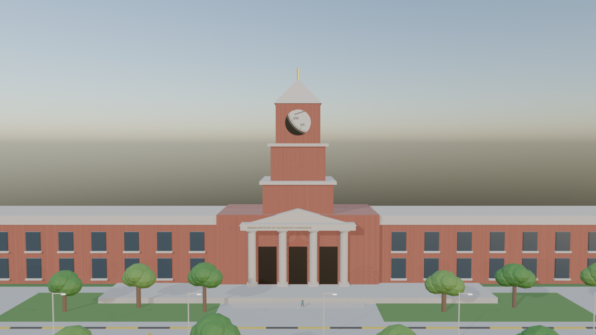
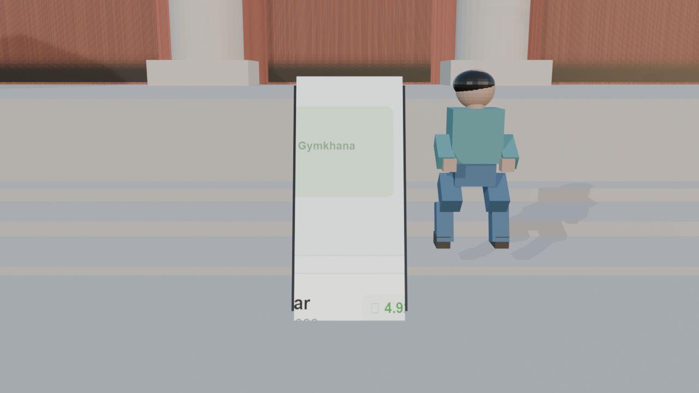
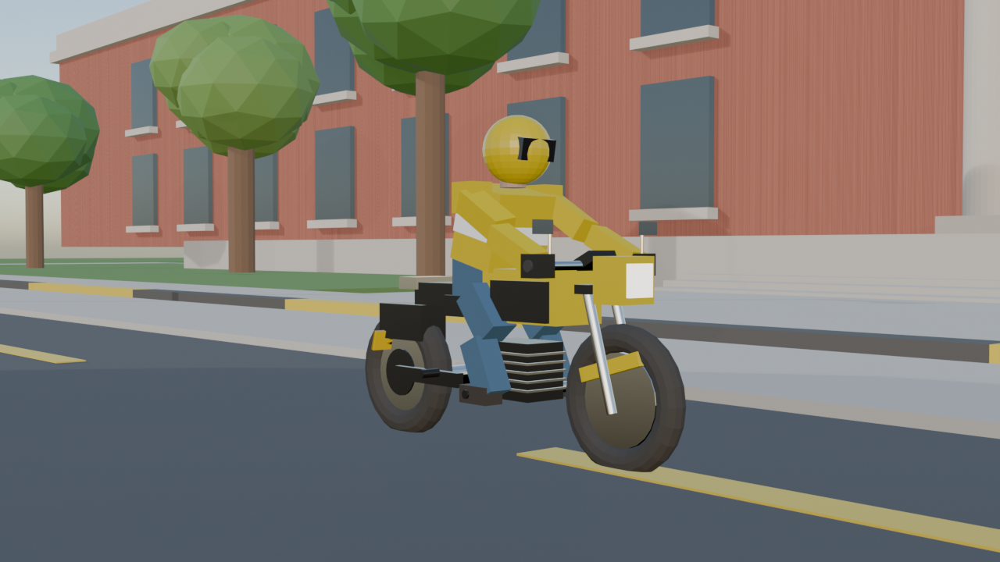
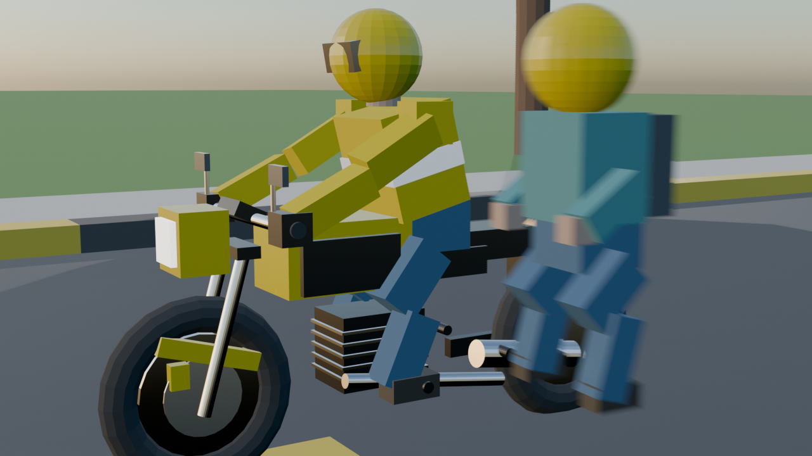
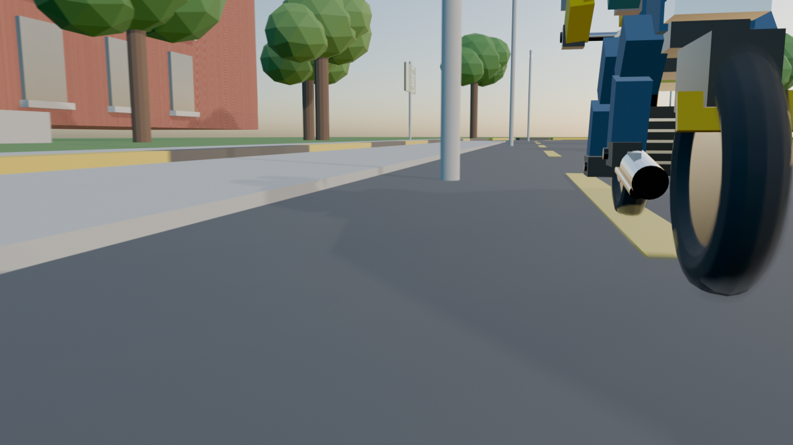
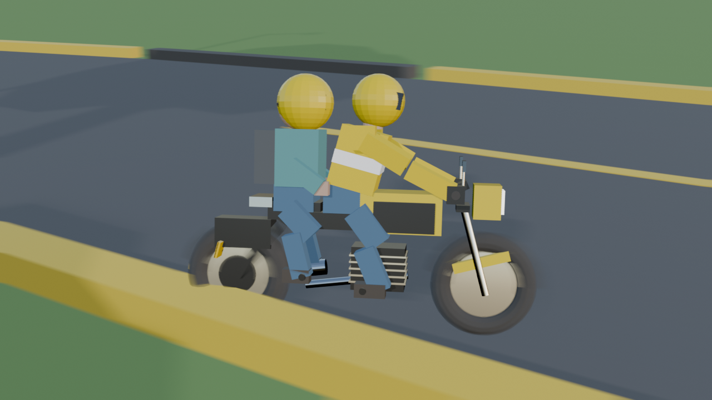
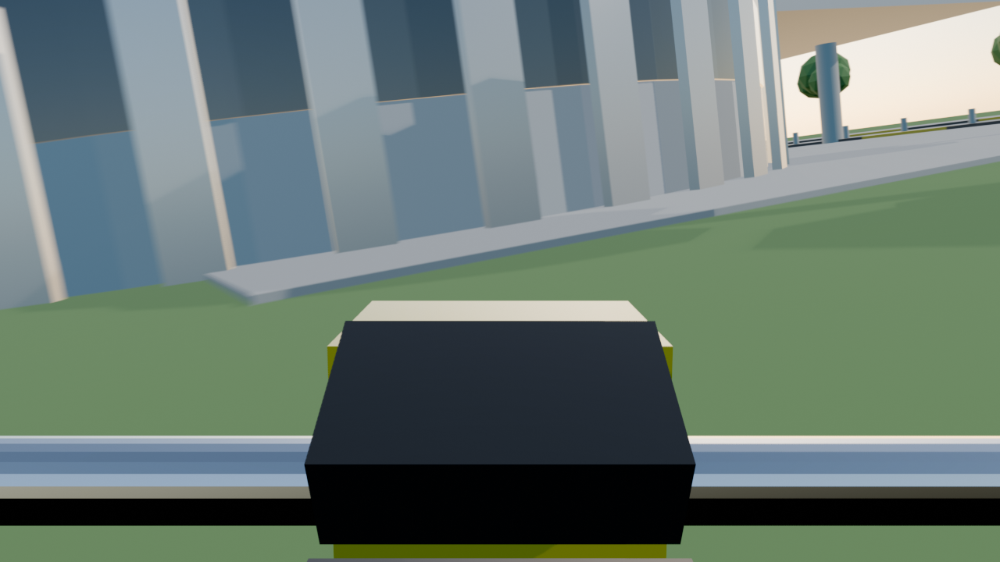
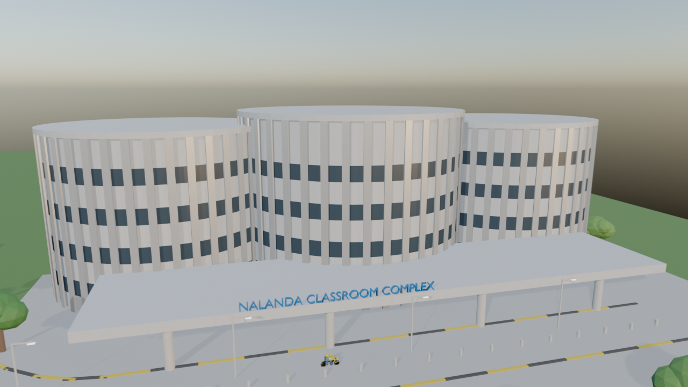
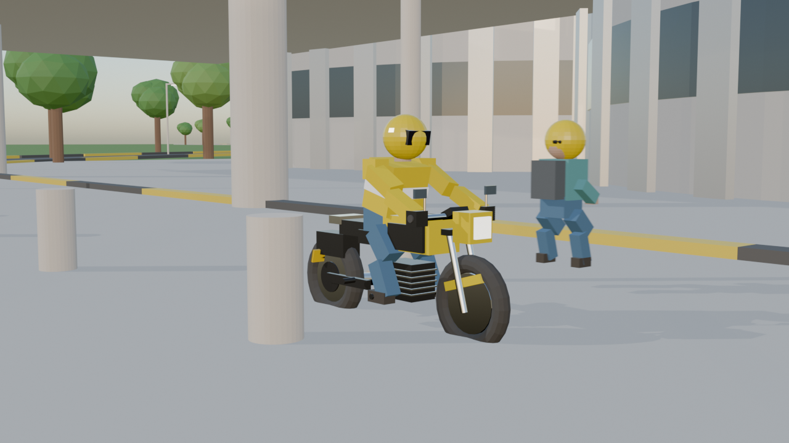
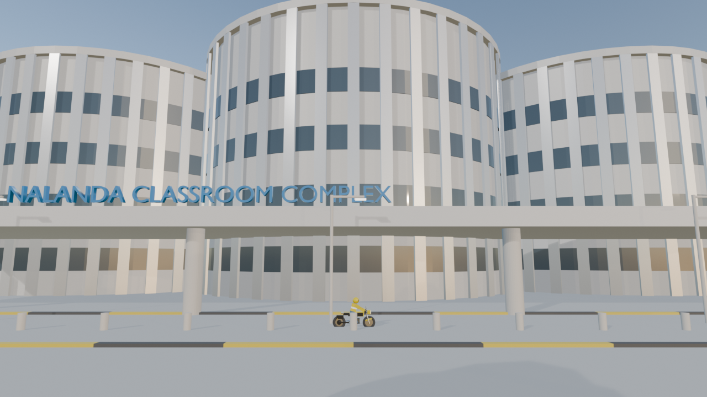

# IIT Kharagpur Rapido Driver Workflow Animation (3D Blender Project)

A complete, cinematic 75-second (1800 frames, 24 FPS) 3D animation created in **Blender 4.5** demonstrating a realistic **Rapido bike taxi workflow inside IIT Kharagpur**.

The animation follows a student passenger requesting a ride at the historic **Hijli Heritage Main Building**, meeting a Rapido Captain on **Scholars' Avenue**, and commuting through campus to the modern **Nalanda Classroom Complex (NR)**.

---

## 🎬 Watch the Full Animation

- **Rendered Video**: [`iitkgp_rapido_animation.mp4`](./iitkgp_rapido_animation.mp4) (1280x720 HD, 24 FPS, H.264 MP4, 75 Seconds)
- **Blender Scene File**: [`iitkgp_rapido_animation.blend`](./iitkgp_rapido_animation.blend) (Open in Blender 4.5+ and press Spacebar to play)

---

## 📸 10-Shot Narrative & Visual Breakdown

| Shot | Still | Frame Range | Camera & Narrative |
| :---: | :---: | :---: | :--- |
| **01** |  | 1 – 180 (0s – 7.5s) | **Establishing Drone Sweep**: Grand high-angle view of the iconic red terracotta brick Main Building, 4-tier clock tower with Roman numeral dials, classical pediment, gold 3D lettering `"INDIAN INSTITUTE OF TECHNOLOGY KHARAGPUR"`, and Scholars' Avenue in golden morning sun. |
| **02** |  | 181 – 330 (7.5s – 13.75s) | **First-Person Smartphone Booking**: Student holding phone on plaza steps; high-res Rapido app UI shows route from Main Building to Nalanda Complex, Captain profile, OTP `4892`, and booking confirmation with Main Building portico in background. |
| **03** |  | 331 – 480 (13.75s – 20s) | **Captain Arrival at Curb**: Low 3/4 tracking shot as the Rapido motorcycle halts smoothly along the yellow/black hazard curb on Scholars' Avenue. Captain pulls up visor with a friendly nod. |
| **04** |  | 481 – 630 (20s – 26.25s) | **Passenger Boarding**: Student puts on passenger safety helmet, mounts the pillion seat, and grips the grab rail as the commuter motorcycle accelerates into the avenue. |
| **05** |  | 631 – 840 (26.25s – 35s) | **Low-Angle Rear Pursuit**: Road-level tracking shot of spinning alloy wheel, rubber tread, and chrome exhaust vibrating as road asphalt whips past at cruising speed (~35 km/h feel). |
| **06** |  | 841 – 1080 (35s – 45s) | **Scholars' Avenue Canopy Chase**: Dynamic side tracker showcasing driver and passenger banking in unison into the road S-curve beneath lush tropical trees and LED streetlights. |
| **07** |  | 1081 – 1290 (45s – 53.75s) | **Motorcycle Cockpit POV**: First-person view over the handlebars and speedometer looking down Scholars' Avenue as the modern Nalanda lecture drums emerge ahead. |
| **08** |  | 1291 – 1470 (53.75s – 61.25s) | **Nalanda Aerial Drone Orbit**: Sweeping aerial drone shot orbiting the 3 interconnected cylindrical lecture drums and entrance canopy as the motorcycle arrives at the drop-off loop. |
| **09** |  | 1471 – 1650 (61.25s – 68.75s) | **Canopy Arrival & Dismount**: Bike glides to a stop at the covered drop-off portico; student dismounts onto the plaza walkway, returns helmet, and exchanges a warm thank-you wave. |
| **10** |  | 1651 – 1800 (68.75s – 75s) | **Hero Outro**: Student walks toward the Nalanda entrance doors with backpack as camera tilts upward showcasing the bold blue 3D `"NALANDA CLASSROOM COMPLEX"` signage and sun louvers under the clear sky. |

---

## 🏛️ Key Architectural & Technical Features

### 1. Hijli Heritage Main Building
- Neoclassical & Art Deco heritage landmark of IIT Kharagpur.
- 4-tier central clock tower with Roman numeral enameled dials (`XII`, `III`, `VI`, `IX`), cornices, and copper spire.
- Classical entrance portico with triangular pediment, dentil molding, and 4 fluted columns.
- Gold 3D architectural lettering on frieze: `"INDIAN INSTITUTE OF TECHNOLOGY KHARAGPUR"`.
- PBR procedural red terracotta brick shader with micro-surface bump and recessed mortar joints.

### 2. Nalanda Classroom Complex (NR)
- 3 monumental cylindrical lecture drums (West, Central, East).
- 48 vertical aerofoil sun-shading louvers (*brise-soleil*) circling each drum.
- 4 levels of curved solar-tinted glass ribbon windows.
- Massive cantilevered drop-off portico canopy with pilotis and warm recessed downlights.
- 3D architectural signage in IIT Blue: `"NALANDA CLASSROOM COMPLEX"`.

### 3. Commuter Motorcycle (Rapido Bike)
- Hero Splendor / Honda Shine commuter class.
- 5-spoke black-and-chrome alloy mag wheels with treaded rubber tires.
- Front ventilated disc brake rotor with golden caliper.
- Multi-finned air-cooled engine block, chrome exhaust pipe with satin heat shield.
- Teardrop fuel tank in Rapido safety yellow with black aerodynamic side covers.
- Physics-based continuous wheel rotation (`rotation_euler.x = distance / radius`).
- Commercial yellow registration plate (`"WB 22 KGP 2026"`).

### 4. Characters & Kinematics
- **Rapido Captain**: Signature bright yellow windcheater with reflective silver safety stripes, denim jeans, boots, yellow helmet with smoked visor, and hands firmly gripping handlebars.
- **Passenger**: Student with casual hoodie, college backpack, passenger helmet, naturally banking into turns and dismounting at Nalanda.

---

## 🛠️ How to Rebuild or Render

### Requirements
- **Blender 4.5+ LTS**
- **Python 3.10+** (with `Pillow` for generating 2D texture assets)

### 1. Generate 2D High-Res Textures
```bash
python generate_highres_textures.py
```

### 2. Build the 3D Scene in Blender
```bash
blender -b -P build_masterpiece_animation.py
```

### 3. Render All Verification Stills
```bash
blender -b -P render_all_shots_stills.py
```

### 4. Render Full 75-Second Video (MP4)
```bash
blender -b -P render_full_video.py
```

---

## 📜 Project Structure

```text
├── iitkgp_rapido_animation.blend      # Master 3D Blender project
├── iitkgp_rapido_animation.mp4        # Rendered 75s HD 720p H.264 video
├── build_masterpiece_animation.py     # Procedural world & character builder
├── generate_highres_textures.py       # High-res 2D texture asset generator
├── render_full_video.py               # Automated video render script
├── render_all_shots_stills.py         # 10-shot still render script
├── rapido_phone_screen.png            # Smartphone booking UI texture
├── iitkgp_clock_face.png              # Clock tower Roman numeral dial
├── campus_road_sign.png               # Scholars' Avenue directional signboard
├── bike_license_plate.png             # Commercial yellow vehicle plate
├── shot01_establishing.png            # Shot 1 still
├── shot02_booking_ui.png              # Shot 2 still
├── shot03_captain_arrival.png         # Shot 3 still
├── shot04_boarding.png                # Shot 4 still
├── shot05_low_pursuit.png             # Shot 5 still
├── shot06_canopy_chase.png            # Shot 6 still
├── shot07_cockpit_pov.png             # Shot 7 still
├── shot08_nalanda_drone.png           # Shot 8 still
├── shot09_nalanda_arrival.png         # Shot 9 still
├── shot10_hero_outro.png              # Shot 10 still
├── .gitignore                         # Ignores backups, caches, and test files
└── README.md                          # Project documentation
```
